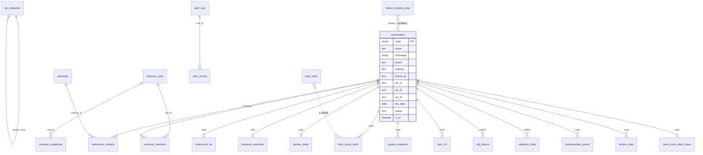
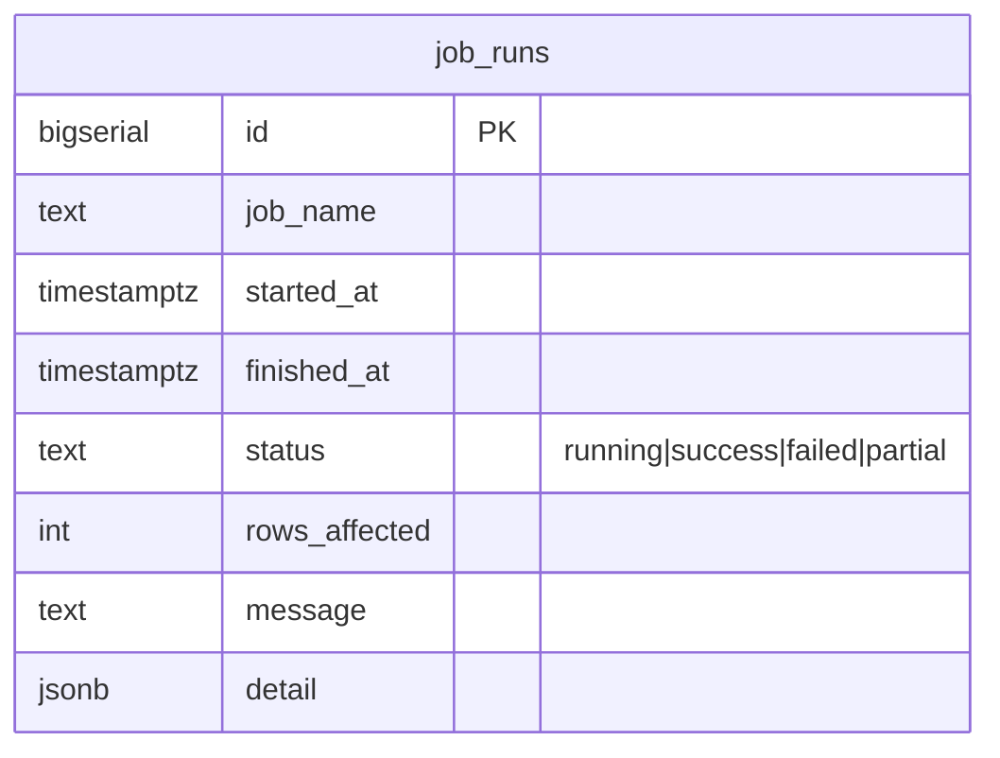
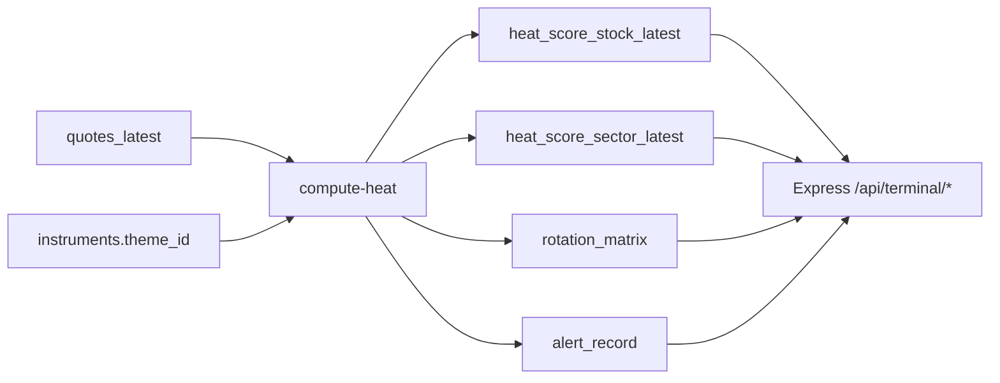

# 当前库表 ER 图（实现态）

> 依据 `collector/sql/001_schema.sql` ~ `004_heat_platform.sql` 整理。  
> 这是**现网实现**，不是设计稿里的 `t_*` 目标蓝图。  
> 标注 `※未填充` 的表：已建 DDL，但当前 job 基本不写数据。

## 总览（按模块）



## 1. 主数据与题材映射

```mermaid
erDiagram
  instruments ||--o{ instrument_industry : "belongs"
  industries ||--o{ instrument_industry : "classifies"
  instruments ||--o| instrument_sw : "has_sw"
  sw_industries ||--o{ sw_industries : "parent"
  theme_industry_map }o..o instruments : "maps_to_theme_id"

  instruments {
    char6 code PK
    text name
    char2 exchange "SH|SZ"
    text board "SH_MAIN|SZ_MAIN|CHINEXT"
    text industry "所处行业文本"
    text theme_id "10题材之一"
    text sw_l1
    text sw_l2
    text sw_l3
    date list_date
    text status
    boolean is_st
    timestamptz updated_at
  }

  industries {
    text id PK
    text name
    text source "※未填充"
  }

  instrument_industry {
    char6 code PK_FK
    text industry_id PK_FK
    date valid_from PK
    date valid_to "※未填充"
  }

  sw_industries {
    text code PK
    text name
    int level "1|2|3"
    text parent_code
    text l1_name
    text l2_name
    text l3_name
  }

  instrument_sw {
    char6 code PK_FK
    text sw_code
    text sw_l1
    text sw_l2
    text sw_l3
    text source
  }

  theme_industry_map {
    serial id PK
    text match_level "l1|l2|l3|name"
    text industry_name
    text theme_id
    int priority
  }

  trading_calendar {
    date trade_date PK
    boolean is_open
  }
```

说明：
- `theme_id` 存在 `instruments` 上（逻辑外键，无独立 themes 表）。
- `theme_industry_map` 通过行业名匹配写入 `theme_id`，无物理 FK。
- `industries` / `instrument_industry` 已建表，当前采集路径主要用 `instruments.industry` 文本。

## 2. 股池（Universe）

```mermaid
erDiagram
  universe_rules ||--o{ universe_members : "selects"
  instruments ||--o{ universe_members : "member"
  instruments ||--o| universe_overrides : "override"
  universe_rules ||--o{ universe_snapshots : "snapshot"

  universe_rules {
    serial id PK
    text name UK
    int universe_size
    numeric weight_roe
    numeric weight_net_profit
    numeric weight_net_profit_yoy
    numeric weight_liquidity
    int min_list_days
    numeric min_avg_amount_20d
    boolean is_active
  }

  universe_members {
    char6 code PK_FK
    int rule_id PK_FK
    date effective_from PK
    date effective_to
    numeric score
    numeric score_roe
    numeric score_net_profit
    numeric score_net_profit_yoy
    numeric score_liquidity
    text reason
  }

  universe_overrides {
    char6 code PK_FK
    text action "force_in|force_out"
    text note
  }

  universe_snapshots {
    bigserial id PK
    int rule_id FK
    date snapshot_date
    int member_count
    jsonb codes
  }
```

## 3. 行情 / 基本面 / 因子

```mermaid
erDiagram
  instruments ||--o| quotes_latest : "latest"
  instruments ||--o{ quotes_snapshot : "intraday"
  instruments ||--o{ bars_1d : "daily"
  instruments ||--o{ adj_factors : "adj※"
  instruments ||--o{ fundamentals_period : "fundamentals"
  instruments ||--o{ valuation_daily : "valuation※"
  instruments ||--o{ factors_daily : "factors"

  quotes_latest {
    char6 code PK_FK
    timestamptz ts
    numeric price
    numeric change_pct
    numeric volume
    numeric amount
    numeric turnover_rate
    text source
  }

  quotes_snapshot {
    timestamptz ts PK
    char6 code PK_FK
    numeric price
    numeric change_pct
    numeric amount
    numeric turnover_rate
  }

  bars_1d {
    date trade_date PK
    char6 code PK_FK
    numeric open
    numeric high
    numeric low
    numeric close
    numeric volume
    numeric amount
    numeric change_pct
  }

  adj_factors {
    date trade_date PK
    char6 code PK_FK
    numeric adj_factor "※未填充"
  }

  fundamentals_period {
    char6 code PK_FK
    date report_date PK
    numeric roe
    numeric net_profit
    numeric net_profit_yoy
    numeric revenue
    jsonb raw
  }

  valuation_daily {
    date trade_date PK
    char6 code PK_FK
    numeric total_mv "※未填充"
    numeric pe_ttm
    numeric pb
  }

  factors_daily {
    date trade_date PK
    char6 code PK_FK
    text factor_name PK
    numeric value
  }
```

## 4. 热力 / 轮动 / 预警

```mermaid
erDiagram
  instruments ||--o{ heat_score_stock : "history"
  instruments ||--o| heat_score_stock_latest : "latest"
  heat_rules }o..o heat_score_stock : "weights"
  alert_rule ||--o{ alert_record : "triggers"

  heat_rules {
    serial id PK
    text name UK
    float w_change
    float w_amount
    float w_turnover
    float w_momentum
  }

  heat_score_stock {
    timestamptz ts PK
    char6 code PK_FK
    text theme_id
    float heat
    float momentum
    float acceleration
    float change_pct
    float amount
    float net_inflow_proxy "代理"
    boolean is_limit_up_approx "代理"
    text data_quality "full|proxy|partial"
    jsonb components
  }

  heat_score_stock_latest {
    char6 code PK_FK
    timestamptz ts
    text theme_id
    float heat
    float momentum
    float acceleration
    float net_inflow_proxy
    boolean is_limit_up_approx
    text data_quality
  }

  heat_score_sector {
    timestamptz ts PK
    text theme_id PK
    float heat
    float momentum
    float acceleration
    float change_pct
    float amount_sum
    int up_count
    int down_count
    int stock_count
    float net_inflow_proxy
    text data_quality
  }

  heat_score_sector_latest {
    text theme_id PK
    timestamptz ts
    float heat
    float momentum
    float amount_sum
    int stock_count
    text data_quality
  }

  sector_quote_snapshot {
    timestamptz ts PK
    text theme_id PK
    float change_pct
    float amount_sum
    int up_count
    int down_count
    int stock_count
  }

  rotation_matrix {
    date trade_date PK
    int slot_30m PK
    text theme_id PK
    int rank
    float heat
    float change_pct
    float momentum
  }

  alert_rule {
    serial id PK
    text name UK
    text rule_type
    boolean enabled
    jsonb params
    text description
  }

  alert_record {
    bigserial id PK
    int rule_id FK
    timestamptz ts
    text alert_type
    text target
    text target_name
    text message
    float trigger_value
    float threshold
    text priority
    jsonb payload
  }
```

说明：
- `theme_id` 在热力/轮动表上是逻辑键（对应 10 个题材），无独立 `themes` 实体表。
- `net_inflow_proxy` / `is_limit_up_approx` 为代理字段，非正式资金流/涨停池。

## 5. 运维



`job_runs` 独立审计表，无 FK。

---

## 表清单速查

| 模块 | 表 | FK 指向 | 填充状态 |
|---|---|---|---|
| 主数据 | `instruments` | — | 在用 |
| 主数据 | `trading_calendar` | — | 在用 |
| 主数据 | `industries` | — | ※未填充 |
| 主数据 | `instrument_industry` | instruments, industries | ※未填充 |
| 题材 | `sw_industries` | 自引用 parent | 可选 |
| 题材 | `instrument_sw` | instruments | 可选 |
| 题材 | `theme_industry_map` | —（逻辑→theme_id） | 在用（种子） |
| 股池 | `universe_rules` | — | 在用 |
| 股池 | `universe_members` | instruments, rules | 在用 |
| 股池 | `universe_overrides` | instruments | 在用 |
| 股池 | `universe_snapshots` | rules | 在用 |
| 行情 | `quotes_latest` | instruments | 在用 |
| 行情 | `quotes_snapshot` | instruments | 在用 |
| 行情 | `bars_1d` | instruments | 在用 |
| 行情 | `adj_factors` | instruments | ※未填充 |
| 基本面 | `fundamentals_period` | instruments | 在用 |
| 基本面 | `valuation_daily` | instruments | ※未填充 |
| 因子 | `factors_daily` | instruments | 在用 |
| 热力 | `heat_rules` | — | 在用 |
| 热力 | `heat_score_stock` | instruments | 在用 |
| 热力 | `heat_score_stock_latest` | instruments | 在用 |
| 热力 | `heat_score_sector` | —（theme_id） | 在用 |
| 热力 | `heat_score_sector_latest` | —（theme_id） | 在用 |
| 热力 | `sector_quote_snapshot` | —（theme_id） | 在用 |
| 轮动 | `rotation_matrix` | —（theme_id） | 在用 |
| 预警 | `alert_rule` | — | 在用 |
| 预警 | `alert_record` | alert_rule | 在用 |
| 运维 | `job_runs` | — | 在用 |

## 核心数据流（非 ER，便于对照）



Schema 源文件：
- [`collector/sql/001_schema.sql`](../collector/sql/001_schema.sql)
- [`collector/sql/002_industry.sql`](../collector/sql/002_industry.sql)
- [`collector/sql/003_sw_industry.sql`](../collector/sql/003_sw_industry.sql)
- [`collector/sql/004_heat_platform.sql`](../collector/sql/004_heat_platform.sql)
